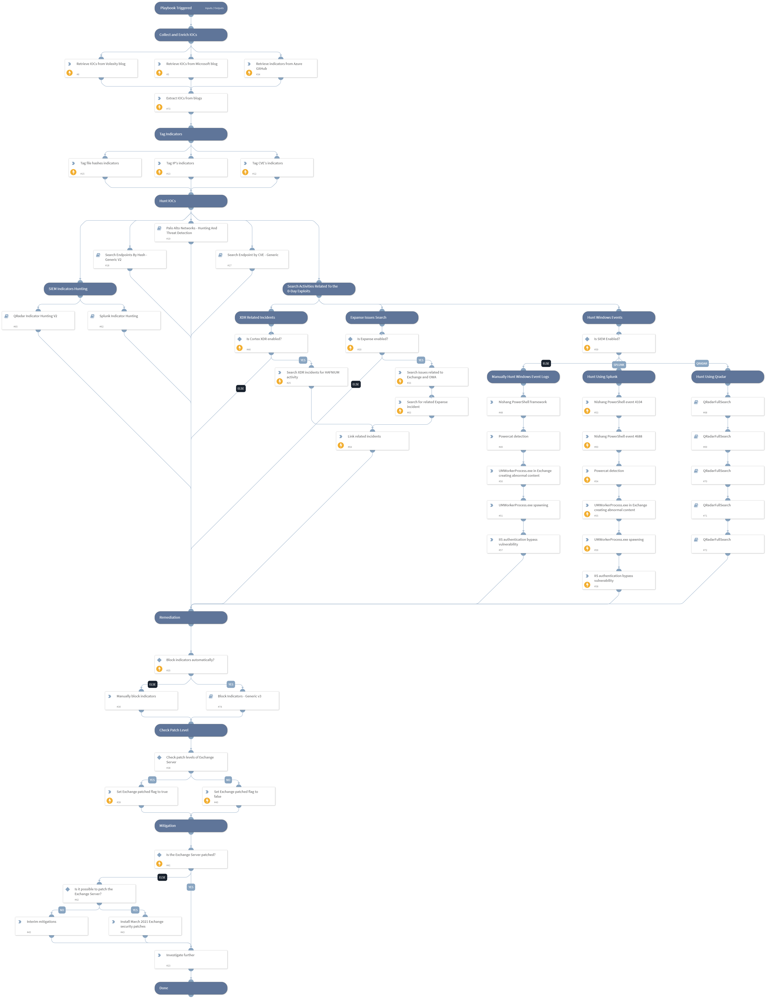

This playbook includes the following tasks:
Collect indicators to be used in your threat hunting process Retrieve IOCs related to HAFNIUM and the exploited exchange 0-day vulnerabilities Discover IOCs related to the attack Query firewall logs to detect malicious network activity Search endpoint logs for malicious hashes to detect compromised hosts (Available from Cortex XSOAR 5.5.0). Block indicators Note: This is a beta playbook, which lets you implement and test pre-release software. Since the playbook is beta, it might contain bugs. Updates to the pack during the beta phase might include non-backward compatible features. We appreciate your feedback on the quality and usability of the pack to help us identify issues, fix them, and continually improve. Read more about the attack on our Unit42 blog: https://unit42.paloaltonetworks.com/microsoft-exchange-server-vulnerabilities/ Sources: https://www.splunk.com/en_us/blog/security/detecting-hafnium-exchange-server-zero-day-activity-in-splunk.html https://www.microsoft.com/security/blog/2021/03/02/hafnium-targeting-exchange-servers/

## Dependencies

This playbook uses the following sub-playbooks, integrations, and scripts.

### Sub-playbooks

* Search Endpoint by CVE - Generic
* Splunk Indicator Hunting
* Palo Alto Networks - Hunting And Threat Detection
* Search Endpoints By Hash - Generic V2
* QRadarFullSearch
* QRadar Indicator Hunting V2
* Block Indicators - Generic v3

### Integrations

This playbook does not use any integrations.

### Scripts

* SearchIncidentsV2
* http
* Set

### Commands

* extractIndicators
* setIndicators
* splunk-search
* expanse-get-issues
* linkIncidents

## Playbook Inputs

---

| **Name** | **Description** | **Default Value** | **Required** |
| --- | --- | --- | --- |
| BlockIndicatorsAutomatically | Whether to automatically indicators involved with HAFNIUM exploits | False | Optional |
| AutoBlockIndicator | By default, the system does not automatically block indicators. However, it is possible to configure the condition to enable automatic blocking of indicators. This can provide an added layer of security and ensure that potentially harmful indicators are prevented from causing any damage. It is important to carefully consider the potential impact of automatic blocking before enabling this feature, as it may lead to legitimate indicators being blocked. | False | Optional |
| UserVerification | This option determines whether user verification is necessary for identified indicators before the playbook can proceed. Default: False | False | Optional |

## Playbook Outputs

---
There are no outputs for this playbook.

## Playbook Image

---

